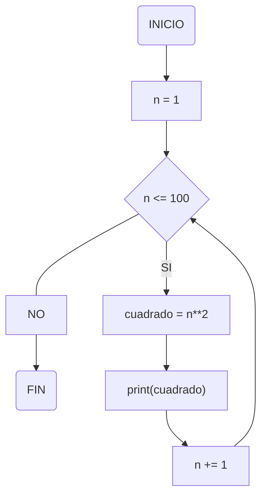
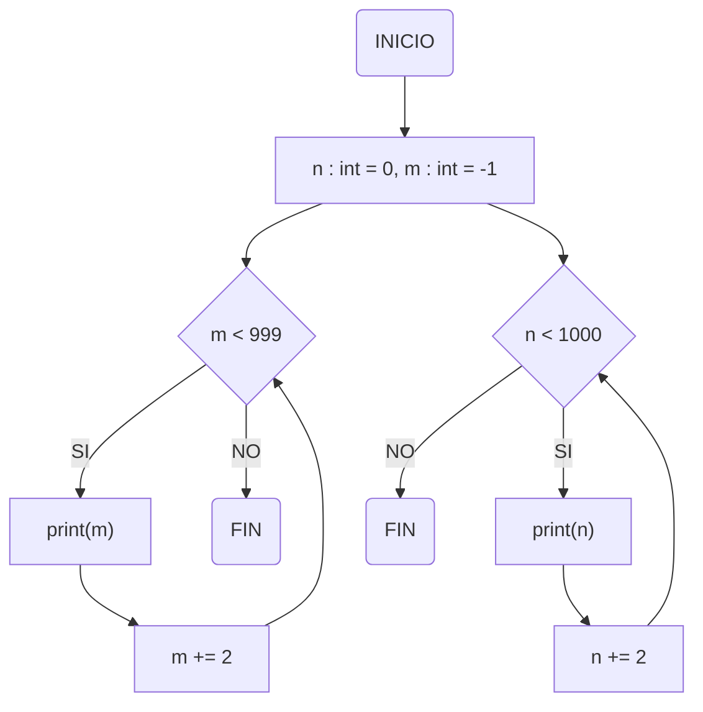
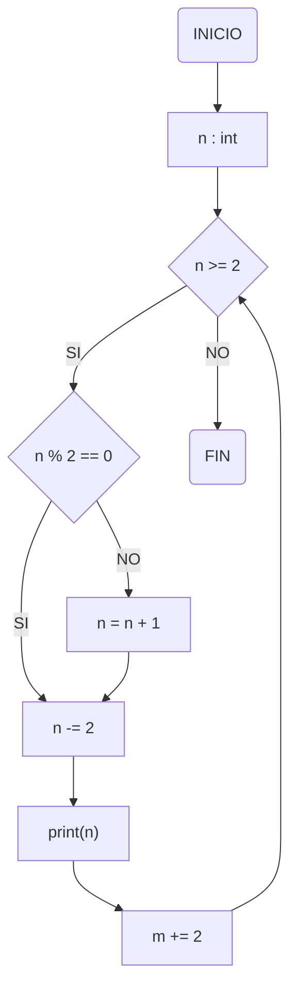

# Reto #7 😲
By Juan Esteban Molina Rey (eljuanessoy)


### 1. Imprimir un listado con los números del 1 al 100 cada uno con su respectivo cuadrado.

+ Para realizar este codigo primero declare la variable n como 1, luego usando "while" hice una iteración para que se vaya creando una lista de números de uno en uno así hasta llegar a cien y cuando llega a cien se imprime la lista.

```python
n : int = 1
while n <= 100:
  cuadrado = n**2
  print(cuadrado)
  n += 1
```



### 2. Imprimir un listado con los números impares desde 1 hasta 999 y seguidamente otro listado con los números pares desde 2 hasta 1000.

+ Para realizar este codigo primero declare la variable n como 0 y la variable m como 1, luego usando "while" hice 2 iteraciónes para que se vayan creando 2 listas de números, una de esas listas es de numeros que empiezan desde 0 y se le suma de a 2 hasta llegar a 1000 y la otra lista hace lo mismo pero empieza desde -1 y termina en 999, y luego de esto se imprime la lista.

```python
n : int = 0
m : int = -1

while m < 999:
    m += 2
    print(m)
    
while n < 1000:
    n += 2
    print(n)
```



### 3. Imprimir los números pares en forma descendente hasta 2 que son menores o iguales a un número natural n ≥ 2 dado

+ Para realizar este codigo primero use input, luego usando "while" hice una iteración para que se vaya creando una lista de números los cuales se les restara 2 si su residuo al dividir por 2 sea 0, y si su residuo no es 0 entonces solo se le suma 1 al valor ingresado y luego se le resta 2, y despues de esto se imprime la lista.

```python
n = int(input("Ingrese un número natural mayor o igual a 2: "))
print(f"Los números pares anteriores a {n} en forma descendente es: ")

while n > 2:
    if n % 2 == 0:
        n -= 2
    else:
        n = n + 1
        n -= 2
    print(n)
```



### 4. En 2022 el país A tendrá una población de 25 millones de habitantes y el país B de 18.9 millones. Las tasas de crecimiento anual de la población serán de 2% y 3% respectivamente. Desarrollar un algoritmo para informar en que año la población del país B superará a la de A.

```python
A : int = 25
B : float = 18.9
Año : int = 2022

while B <= A:
    CrecimientoAnualA = (A * 0.02)
    CrecimientoAnualB = (B * 0.03)
    A += CrecimientoAnualA
    B += CrecimientoAnualB
    Año += 1

print(f"Para el año {Año} la población B superará a la población A")
```

### 5. Imprimir el factorial de un número natural n dado.

```python
m = int(input("Ingrese un número natural: "))
ResultadoFactorial = 1

while m > 0:
  ResultadoFactorial *= m
  m -= 1

print(f"El factorial del valor ingresado es: {ResultadoFactorial}")
```

### 6. Implementar un algoritmo que permita adivinar un número dado de 1 a 100, preguntando en cada caso si el número es mayor, menor o igual.

```python
import random
def adivinar():
    print("Piensa en un número de 1 a 100, de seguro lo adivinare a la primera :D")
    print("(Escribe 'Si' si es igual, 'Menor' si es menor o 'Mayor' si es mayor)")
    min = 1
    max = 100
    while True: 
        n = random.randint(min, max)
        print(f"¿El número en el que pensaste es {n}?")
        respuesta = input()
        if respuesta == 'Si':
            print("Ves? Te dije que lo adivinaria a la primera")
            break
        elif respuesta == 'Menor':
            max = n - 1
        elif respuesta == 'Mayor':
            min = n + 1
        else:
            print("Creo que deberias leer las instrucciones que te di :d")
            break
adivinar()
```

### 7. Implementar un programa que ingrese un número de 2 a 50 y muestre sus divisores.

```python
n = int(input("Ingresa un valor de 2 a 50: "))
x : int = n
print(f"Los divisores de {n} son:")

while x >= 1:
    if n % x == 0:
        print(x)
    x -= 1
```

### 8. Implementar el algoritmo que muestre los números primos del 1 al 100. **Nota:** use funciones

```python
def NumerosPrimos(n):
    while n <= 100:
        i = 2
        primo = True
        while i < n:
            if n % i == 0:
                primo = False
                break
            i += 1
        if primo:
            print(n)
        n += 1

if __name__ == "__main__":
    n = 2
    NumerosPrimos(n)
```

###### Recuerda que sin importar tu 
# **SEXO**
###### puedes dejar una estrellita
# **GRATIS**
###### para apoyar el trabajo :D
##### Hablando enserio si consideras que este repo fue de ayuda para ti, estaria muy agradecido si dejaras una estrellita, muchas gracias amix 🙏🙏🙏
